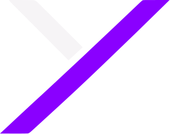

<p align="center">
  
</p>

<h1 align="center" style="font-family: 'Space Grotesk', sans-serif; letter-spacing: -0.03em;">
  SIX<span style="color:#8A00FF">T</span>
</h1>

<p align="center">
  
  
  
  
</p>

<p align="center">
  
  
  
</p>

---

## Visão geral

O projeto nasceu como uma página estática em HTML/CSS/JS e foi **migrado para React**, preservando 100% do conteúdo original e ganhando direção de arte profissional.

- **Essência**: clareza, inteligência, movimento, transformação e resultado
- **Narrativa visual**: nodes (`● ◉ ◎`) como pontos, linhas como conexões, movimento como evolução
- **Assinatura**: um círculo roxo que percorre a página inteira conforme o scroll

---

## Design System

Tokens centralizados em [`src/styles/variables.css`](src/styles/variables.css).

### Cores

| Nome | Token | Valor |
|---|---|---|
| Roxo principal | `--purple` | `#8A00FF` |
| Roxo escuro | `--purple-dark` | `#5C00B8` |
| Roxo claro | `--purple-bright` | `#A94DFF` |
| Roxo suave | `--purple-soft` | `#D9B3FF` |
| Preto | `--black` | `#000000` |
| Branco | `--white` | `#FFFFFF` |

Escala de neutros de `#080808` a `#F7F7F7`, com tintas de roxo para superfícies e glows contidos.

### Tipografia

| Função | Fonte | Pesos |
|---|---|---|
| Headings | Space Grotesk | 500–700 |
| Body / UI | Montserrat | 400–700 |

Escalas responsivas via `clamp()` — H1 até 64px no desktop e 28px no mobile.

### Espaçamento & ritmo

Base de **8px** (`4 → 96`) e alternância dark/light entre seções para criar ritmo narrativo:

```text
HERO (dark) → SERVIÇOS (light) → MOVIMENTO (dark) → MANIFESTO (light) → EQUIPE (dark) → CONTATO (light) → FOOTER (black)
```

---

## Estrutura do projeto

```text
sixt-landing/
├── index.html                  # Entrada (fontes Google, favicon SVG)
├── package.json
├── vite.config.js
└── src/
    ├── main.jsx                # Bootstrap + ordem de estilos
    ├── App.jsx                 # Composição: Navbar → main → Footer
    ├── styles/
    │   ├── variables.css       # Tokens do Design System
    │   ├── globals.css         # Reset, layout, tipografia base
    │   └── animations.css      # Reveal + prefers-reduced-motion
    ├── data/
    │   └── content.js          # Todo o conteúdo editável
    ├── assets/team/            # Fotos dos integrantes
    ├── components/
    │   ├── Navbar/             # Fixa, scroll spy, menu mobile
    │   ├── Footer/
    │   ├── ScrollJourney/      # ★ Círculo roxo guiado por scroll
    │   ├── GrowthChart/        # ★ Gráfico interativo da hero
    │   ├── SectionHeader.jsx   # Label + título + descrição
    │   ├── Reveal.jsx          # Animação de entrada compartilhada
    │   ├── Node.jsx            # Sistema ● ◉ ◎ + DotLine
    │   ├── Button.css          # Variantes primary/secondary
    │   └── icons.jsx           # Ícones lineares SVG
    └── sections/
        ├── Hero/
        ├── Services/
        ├── Movement/
        ├── Manifesto/
        ├── Team/
        └── Contact/
```

---

## Componentes em destaque

### ScrollJourney — assinatura do site
- Círculo roxo que percorre toda a página vinculado ao progresso do scroll
- Trajetória em curvas Bézier com tangentes verticais, alternando esquerda/direita
- Linha desenhada progressivamente (`stroke-dashoffset`)
- **Smooth follow** via `requestAnimationFrame` + lerp (fator 0.11)
- Marcadores que acendem quando o círculo passa; respeita `prefers-reduced-motion`

### GrowthChart — painel analítico da hero
- Curva que conta a narrativa: ESTRATÉGIA → DESIGN → TECNOLOGIA → RESULTADO → IMPACTO
- **Interativo**: mouse/toque move uma linha de scan e destaca o ponto mais próximo
- `touch-action: pan-y` para não travar o scroll no celular

### Carrossel da equipe (Swiper)
- 3 slides no desktop, 2 no tablet, 1 no mobile; loop habilitado
- Paginação com bullets que alongam em roxo; cards em grayscale que colorem no hover

### Sistema de Nodes
- `Node`: variantes `dot` ●, `core` ◉, `ring` ◎, `outline`, com pulso opcional
- `DotLine`: dois pontos conectados por linha — usado na hero e rodapé

---

## ♿ Acessibilidade & ⚡ Performance

- Skip link, HTML semântico, `aria-label`/`aria-modal` no menu mobile
- Foco visível roxo e navegação por teclado (Esc, setas)
- `@media (prefers-reduced-motion: reduce)` desliga reveals, pulsações e o loop do círculo
- Animações apenas em `transform`/`opacity` — nada de top/left/width/height
- Um único listener de scroll passivo + um loop de rAF no site inteiro
- Imagens com `loading="lazy"` e `decoding="async"`
- Bundle final: **~85KB gzip (JS)** + **~8KB gzip (CSS)**

---

## Responsividade

Breakpoints: **380 · 640 · 720 · 900 · 1024 · 1099 · 1200px**

- Trajetória do círculo simplificada no mobile; nodes importantes preservados
- Menu dedicado (hambúrguer → overlay fullscreen)
- Sem overflow horizontal
- Testado em 320 / 375 / 390 / 430 (mobile) e 1280 / 1440 / 1920 (desktop)

---

## Como rodar

```bash
# Instalar dependências
npm install

# Ambiente de desenvolvimento
npm run dev

# Build de produção (pasta dist/)
npm run build

# Preview do build
npm run preview
```

---

## Conteúdo editável

Todo o texto do site vive em um único arquivo: [`src/data/content.js`](src/data/content.js)

```js
NAV_LINKS       // Links da navbar
SERVICES        // Os serviços (número, ícone, título, descrição, destaque)
MOVEMENT_STEPS  // Etapas do processo
TEAM            // Integrantes (nome, foto, bio, LinkedIn, GitHub)
SOCIALS         // Canais de contato
```

Para trocar a foto de alguém: substitua o arquivo em `src/assets/team/` mantendo o nome.

